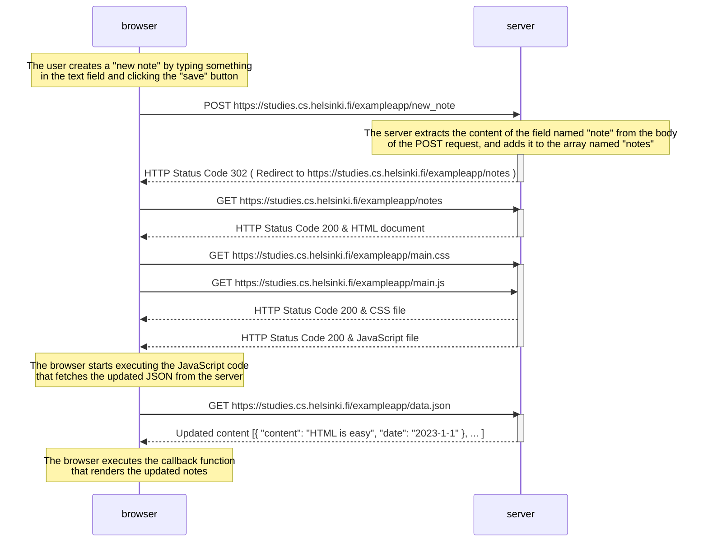

```mermaid
sequenceDiagram
    participant browser
    participant server

    Note over browser: The user creates a "new note" by typing something <br/>in the text field and clicking the "save" button

    browser->>server: POST https://studies.cs.helsinki.fi/exampleapp/new_note
    Note over server: The server extracts the content of the field named "note" from the body<br/> of the POST request, and adds it to the array named "notes"
    activate server
    server-->>browser: HTTP Status Code 302 ( Redirect to https://studies.cs.helsinki.fi/exampleapp/notes )
    deactivate server

    browser->>server: GET https://studies.cs.helsinki.fi/exampleapp/notes
    activate server
    server-->>browser: HTTP Status Code 200 & HTML document
    deactivate server

    browser->>server: GET https://studies.cs.helsinki.fi/exampleapp/main.css        
    activate server
    browser->>server: GET https://studies.cs.helsinki.fi/exampleapp/main.js
    
    server-->>browser: HTTP Status Code 200 & CSS file
    server-->>browser: HTTP Status Code 200 & JavaScript file
    deactivate server
    Note over browser: The browser starts executing the JavaScript code <br/>that fetches the updated JSON from the server
    
    browser->>server: GET https://studies.cs.helsinki.fi/exampleapp/data.json
    activate server
    server-->>browser: Updated content [{ "content": "HTML is easy", "date": "2023-1-1" }, ... ]
    deactivate server

    Note over browser: The browser executes the callback function <br/> that renders the updated notes
```
