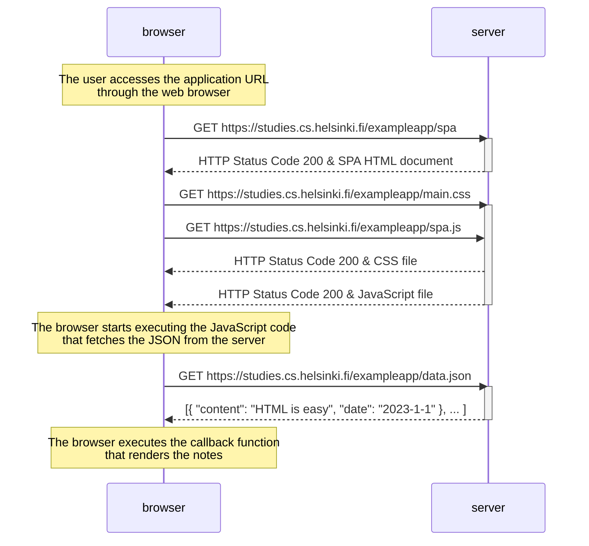

```mermaid
sequenceDiagram
    participant browser
    participant server

Note over browser: The user accesses the application URL <br/>through the web browser

    browser->>server: GET https://studies.cs.helsinki.fi/exampleapp/spa
    activate server
    server-->>browser: HTTP Status Code 200 & SPA HTML document
    deactivate server

    browser->>server: GET https://studies.cs.helsinki.fi/exampleapp/main.css
        
    activate server
    browser->>server: GET https://studies.cs.helsinki.fi/exampleapp/spa.js
    
    server-->>browser: HTTP Status Code 200 & CSS file
    server-->>browser: HTTP Status Code 200 & JavaScript file
    deactivate server
    Note over browser: The browser starts executing the JavaScript code <br/>that fetches the JSON from the server
    
    browser->>server: GET https://studies.cs.helsinki.fi/exampleapp/data.json
    activate server
    server-->>browser: [{ "content": "HTML is easy", "date": "2023-1-1" }, ... ]
    deactivate server

    Note over browser: The browser executes the callback function <br/> that renders the notes
```
