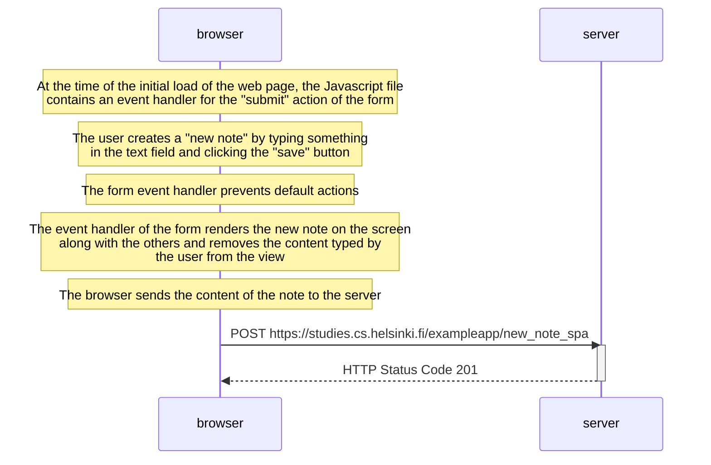

```mermaid
sequenceDiagram
    participant browser
    participant server

    Note over browser: At the time of the initial load of the web page, the Javascript file <br/>contains an event handler for the "submit" action of the form
    
    Note over browser: The user creates a "new note" by typing something <br/>in the text field and clicking the "save" button

    Note over browser: The form event handler prevents default actions

    Note over browser: The event handler of the form renders the new note on the screen <br/>along with the others and removes the content typed by <br/>the user from the view

    Note over browser: The browser sends the content of the note to the server


    browser->>server: POST https://studies.cs.helsinki.fi/exampleapp/new_note_spa
    activate server
    server-->>browser: HTTP Status Code 201
    deactivate server

```